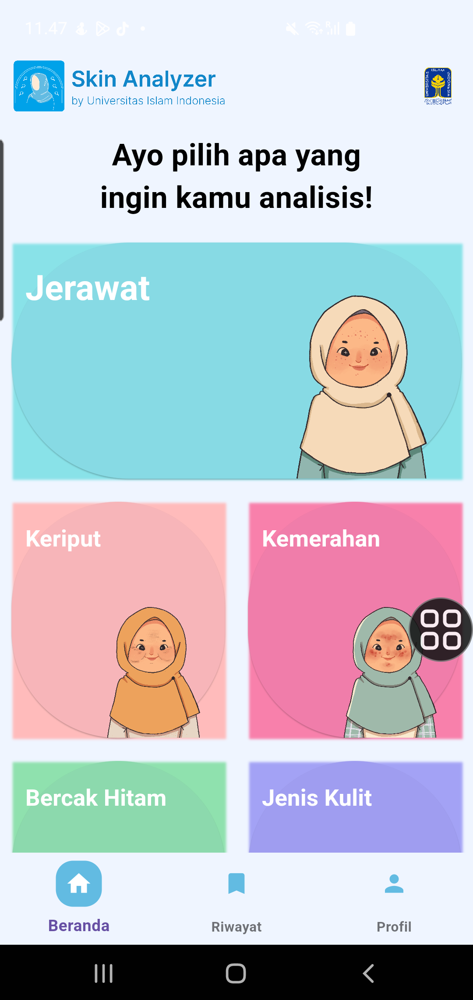
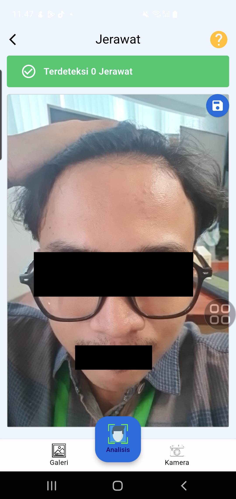

# ✨ UII Skin Analyzer

**Revolutionizing Dermatology with AI-Powered Skin Analysis**

UII Skin Analyzer is a cutting-edge mobile application built with Flutter that provides real-time, smart analysis of various skin conditions. Designed for the Innovation Bootcamp, this app leverages advanced image processing and machine learning to help users understand their skin health better.

---

## 🚀 Key Features

- 🔬 **Smart Acne Analysis**: Deep-scan identification of acne severity and types.
- 📉 **Wrinkle Detection**: Precise identification of fine lines and aging patterns.
- 🛑 **Redness & Inflammation**: Instant detection of skin irritation and sensitivity.
- 🌑 **Black Spot Analysis**: Detailed mapping of hyperpigmentation and sun damage.
- 📊 **Skin Health History**: Interactive charts and logs to track your skin journey over time.
- 👤 **Unified Profile**: Seamless synchronization across devices using Firebase.

---

## � Snapshots of App

<div align="center">
  
  
</div>

---

## �🛠 Tech Stack

- **Frontend**: [Flutter 3.19.0](https://flutter.dev/) & [Dart 3.3.0](https://dart.dev/)
- **Backend**: Python Flask AI Server (External)
- **Database & Auth**: [Firebase](https://firebase.google.com/) (Firestore & Authentication)
- **State Management**: Provider / Managed State
- **Hardware Integration**: High-performance CameraX integration

---

## 📋 Minimum Requirements

| Requirement | Specification |
| :--- | :--- |
| **Flutter SDK** | 3.19.0 |
| **Dart SDK** | 3.3.0 |
| **Android OS** | API 21+ (Lollipop) |
| **iOS OS** | 12.0+ |
| **Developer Tool** | FVM (Flutter Version Management) highly recommended |

---

## ⚙️ Project Setup & Installation

### 1. Prerequisite: FVM (Recommended)
This project is pinned to specific versions for stability. Install [FVM](https://fvm.app/) first:
```bash
dart pub global activate fvm
fvm use 3.19.0
```

### 2. Dependency Setup
```bash
fvm flutter pub get
```

### 3. Firebase Configuration
Manual setup is required as native configuration files are ignored by version control for security purposes.

#### Method A: Manual File Placement
- **Android**: Obtain `google-services.json` from your Firebase Console and place it in `android/app/`.
- **iOS**: Obtain `GoogleService-Info.plist` from your Firebase Console and place it in `ios/Runner/`.

#### Method B: FlutterFire CLI (Recommended)
If you have the [FlutterFire CLI](https://firebase.flutter.dev/docs/cli) installed, you can reconfigure the project automatically:
```bash
flutterfire configure
```
This will regenerate the necessary configuration files for your specific Firebase project environments.

### 4. API Configuration
Update your server address in `lib/config/api_config.dart`:
```dart
static const String baseUrl = 'http://10.0.2.2:5050'; // For Android Emulator
```

---

## 🏃 How to Run

### Debug Mode (Recommended for Dev)
Best for development with **Hot Reload** and detailed logging.
```bash
fvm flutter run
```

### Release Mode
optimized for performance and end-user testing.
```bash
fvm flutter build apk --release
```

---

## 📱 Project Structure
- `lib/widgets/analysis`: Core AI analysis screens.
- `lib/widgets/history`: Data visualization and progress tracking.
- `lib/config`: Centralized API and app configurations.
- `lib/main.dart`: App entry point and Firebase initialization.

---

**Developed for Innovation Bootcamp | UII Skin Analyzer Team**
